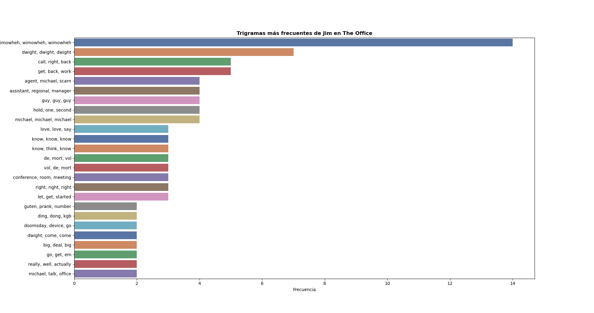

# Natural Language Processing with Python for The Office
This following scripts explore different aspects of Natural Language Processing using the transcription of the The Office series. It was created with **educational purposes**. I have used this dataset [The Office (US) - Complete Dialogue/Transcript](https://www.kaggle.com/nasirkhalid24/the-office-us-complete-dialoguetranscript/).

## Features
1. Character Wordcloud generator using the [wordcloud library](https://pypi.org/project/wordcloud/).
2. Get a character n-grams from his/her text lines. 
3. Analyse a character sentiments expressed in The Office using the [VADER (Valence Aware Dictionary and sEntiment Reasoner) library](https://github.com/cjhutto/vaderSentiment). We quantify sentiment polarity (positive/negative) on a scale from -1 to 1. 
4.  Analyse a character sentiments expressed in The Office using the [TextBlob library](https://github.com/sloria/TextBlob). We quantify sentiment polarity (positive/negative) on a scale from -1 to 1 and subjectivity (objective/subjective) on a scale from 0 to 1.
5. Research affinity between characters from the the sentiment analysis of their lines during the scene where they appear. 
 
## Technologies
- Python 3.8.5

## Example of use
### Wordcloud
```
python nubePalabras.py Pam 
```


### n-gram

```
python ngram_TheOffice.py
```


### Sentiment analysis using TextBlob
```
python SentimentAnalysis_TextBlob.py 
```


### Sentiment analysis using VADER
```
python SentimentAnalysis_Vader.py 
```


### Affinity analysis
Representing polarity and subjectivity obteined  from Pam and Jim's lines in scenes where both appear. 

```
python afinidadPersonajes.py
```


